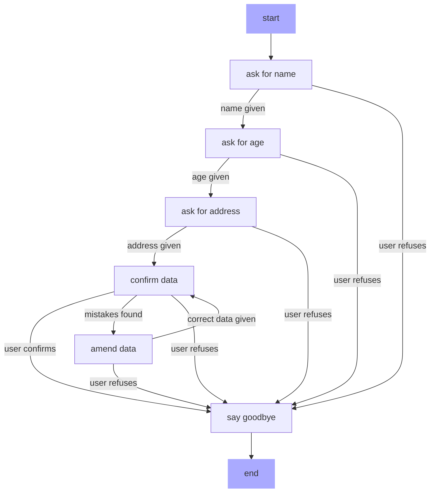
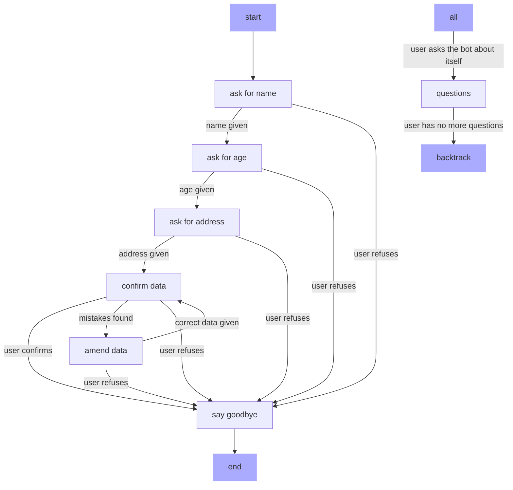

# High-level Concepts

Intentional lets you control the way your chatbot behaves by specifying a **conversation graph** made of several **stages**.

At each stage, the bot has a very specific **goal** to accomplish and will stick to it until it reaches one of the **outcomes** you specify. Once the bot is confident that one of the outcomes is reached, it will move over to the next stage and continue along the conversation graph in this way.

For example, here is an example of a conversation graph:

## Stages

Each box of this diagram is a **stage**. The bot is always going to be in one of these stages, and each of them includes the description of a **goal** that the bot needs to accomplish. For example, the goal of the stage `ask for name` might be "Ask the user for their name".

!!! note

    The dark boxes (`start`, `end`) are not stages, but represent **special operations** that the bot will do once the necessary conditions are met, such a starting the chat or ending it. To learn more about these operations, check out the section about the configuration file.

## Outcomes

Each stage has a number of named arrows connecting it to other stages. For example, `ask for name` is connected to `ask for age` through the `name given` arrow and to `say goodbye` through the `user refuses` arrow. These arrows represent all the **outcomes** that we think are possible from a given stage, and make the bot transition from one stage to the next. Outcomes have their own description to help the bot understand when they are reached: for example, the description of the `name given` outcome may be "The user clearly stated their name".

!!! note

    Have you noticed that there are **no arrows connecting one stage to itself**?

    There are also no generic outcomes that represent situations where the user did not understand the question, or when their reply is not matching the question in some way.

    This is because **the bot can take care of these issues on its own**. By default it will not change state until one of the described outcomes is reached. In all other cases, it will stay on the same stage and try again to get the conversation to one of the outcomes we defined and nothing else.

## Tools

Each stage can specify a list of tools that it must have access to. If a stage specifies a tool, it will only be available from that stage: for example, the `ask for address` stage may have access to a Maps API to validate the address that the user has given. Such tool won't be available when the bot is in any other stage, making it easier for the bot to avoid calling it by mistake.

## External stages and backtracking

In real life conversations the bot may need to handle generic interruptions of its workflow. For example, the user may wonder why the bot is collecting this information about them only when they reach the address stage.

Here is an example of a conversation graph with such a stage, which we are going to call `questions`.

In this case, the `question` state not only has a goal, but it also has a **description**: the bot should switch to it, regardless where it is right now, when the user does something that matched its description. In this case, the description may be "The user asks the bot a question about itself".

Once the bot enters this stage, it must be able to return to wherever it was before jumping to this stage. For example, if it was asking the user for their address, it switch back to that state and ask for their address again. This will be done by the **`backtrack`** operation.

!!! note

    In this simple example, the `question` stage is accessible from all other stages. However, stages can restrict access to themselves with an inclusion or an exclusion list. See the section about the configuration file to understand how this works.

# Under the hood

!!! warning

    Work in progress
